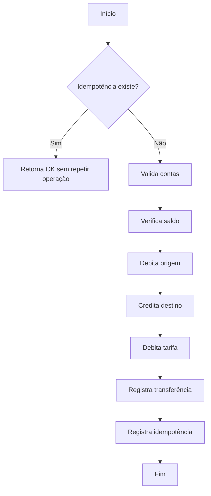

# BancoAna Account API — Documentação Completa


---

## 📌 Visão Geral

A **BancoAna Account API** é uma API REST desenvolvida em **.NET 8**, voltada para simular funcionalidades de um sistema bancário digital.  
Ela permite operações como **criação de contas**, **movimentações**, **transferências**, **controle de idempotência**, **tarifas automáticas**, **login com JWT**, e **consulta de saldo**.

---

## 🏛️ Arquitetura da API
```text
BancoAna.Account.Api/
 ├── Controllers/
 ├── Application/
 ├── Domain/
 ├── Infrastructure/
 ├── Services/
 └── Tests/
```

---

## 🗃️ Banco de Dados (SQLite)

### Tabelas
- **contacorrente**  
- **movimento**  
- **transferencia**  
- **tarifa**  
- **idempotencia**

---

## 🔐 Autenticação

A API usa **JWT**:
```
POST /api/account/login
Authorization: Bearer TOKEN
```

---

## 📖 Endpoints

### Criar Conta
```
POST /api/account
```

### Login
```
POST /api/account/login
```

### Criar Movimento
```
POST /api/account/movimentos
```

### Transferência
```
POST /api/account/transferencia
```

### Consultar Saldo
```
GET /api/account/saldo
```

---

## ⚙️ Diagrama de Fluxo — Transferência


---

## 🧪 Testes

Os testes incluem:
- Criação de conta
- Login
- Movimentos
- Transferência
- Idempotência
- Saldo

---

## ▶️ Como Executar

```bash
dotnet build
dotnet run --project BancoAna.Account.Api
```

URLs:
```
https://localhost:7234
http://localhost:5234
```

---

## 📦 Tecnologias

- .NET 8  
- SQLite  
- Dapper  
- JWT  
- BCrypt  
- xUnit  
- FluentAssertions  
- MermaidJS  

---

## 🎉 Final